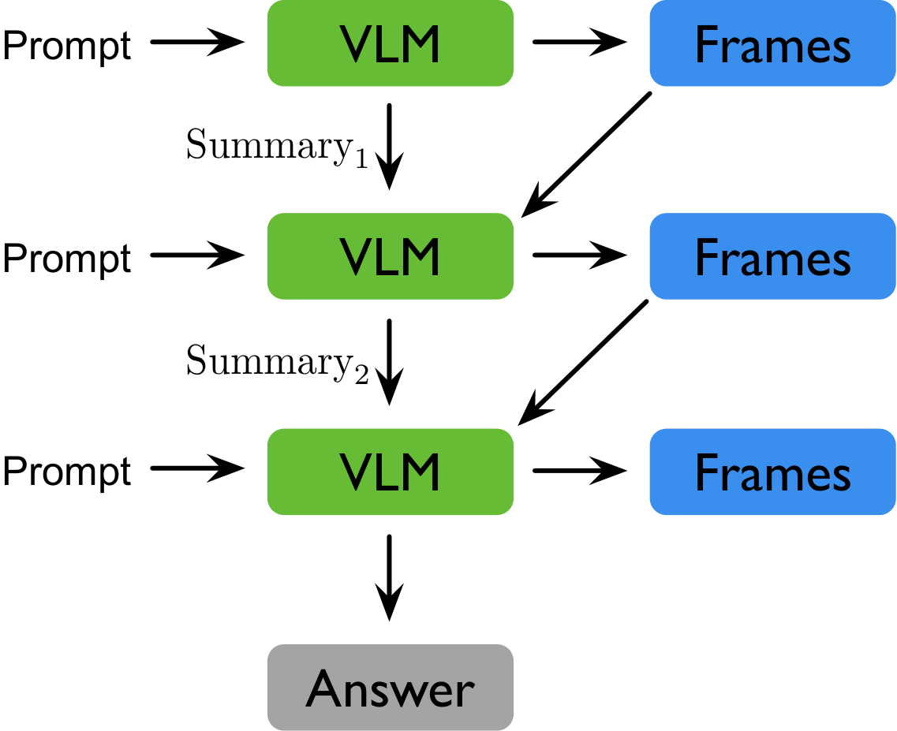
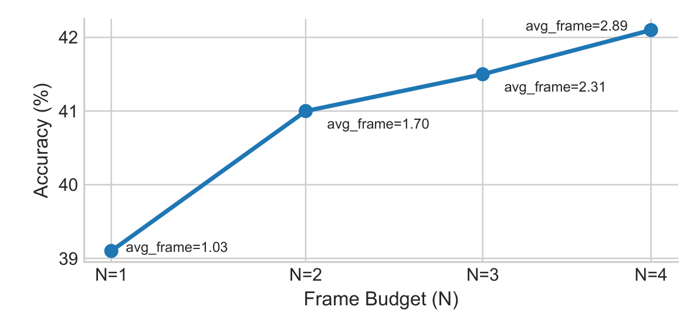

# REVISE: Reasoning with Video Sparsity

This repository contains the code for **REVISE**, a framework for question-aware sparse video understanding.

REVISE addresses two core challenges in video QA: **information overload** (processing too many redundant frames) and **insufficient key-information awareness** (missing the frames that actually matter). It does so through a multi-round agent loop that iteratively selects a small number of informative frames while maintaining a compact **summary-as-state** across rounds.

## Method Overview

<p align="center">
  
</p>

**Summary-as-State.** REVISE operates analogously to a recurrent neural network: it maintains a compact state that propagates information from previous rounds to the VLM, without re-admitting raw frames or conversation history.

<p align="center">
  
</p>

Each round, the agent receives sampled video frames, the question, and its current summary state. It produces a structured summary using the **POHR** format:

| Field | Description |
|-------|-------------|
| **P** (Previously seen) | What frames have been inspected so far |
| **O** (Observations) | What was just observed in the current frames |
| **H** (Hypotheses) | How observations update the current belief |
| **U** (Uncertainties) | What remains unclear |
| **R** (Reasons) | Why specific new frames are needed, or why the question is now answerable |

The agent then either requests more frames (`<frames>`) or produces a final answer (`<answer>`). Only the summary persists between rounds — not raw frames or conversation history — keeping the context compact.

**Two operating modes:**

1. **Plug-and-play**: wraps any VLM (including proprietary APIs like GPT-4o) as a frozen black-box — no parameter updates needed.
2. **RL fine-tuning**: uses GRPO with the **EAGER** (Evidence-Adjusted Gain for Efficient Reasoning) reward, which combines confidence gain, summary sufficiency, and correct-and-early-stop bonuses — all annotation-free.

### Qualitative Example

<p align="center">
  
</p>

The agent starts with 3 uniformly sampled frames, updates its POHR summary, identifies uncertainty, requests targeted frames, and arrives at the answer — all within 2 rounds using only 6 frames from a 15-second video.

## Key Results

| Benchmark | Model | Accuracy | Avg Frames |
|-----------|-------|----------|------------|
| VideoEspresso | GPT-4o + REVISE | 48.9% | 8.0 |
| NExT-QA | GPT-4o + REVISE | 63.8% | 8.4 |
| EgoSchema | GPT-4o + REVISE | 60.6% | 9.8 |
| NExT-QA | Qwen2.5-VL-3B + REVISE + RL | 51.3% | 3.9 |

RL fine-tuning yields **+19.6pp accuracy** over plug-and-play on NExT-QA while using **fewer frames, fewer rounds, and nearly 2x faster inference**.

<p align="center">
  
</p>

More rounds yield better accuracy at lower average frame budgets — the agent learns to stop early when confident.

## Installation

```bash
conda create -n verlrun python=3.10 -y
conda activate verlrun

pip install -U pip
pip install -e .
```

Install the inference backend you plan to use:

```bash
# SGLang (recommended)
pip install -r requirements_sglang.txt

# vLLM
pip install -r requirements.txt
# or: pip install -e ".[vllm]"

# GPU extras (flash-attention, liger-kernel)
pip install -e ".[gpu]"
```

## Quickstart

Paper-level reproduction entrypoints:

```bash
ENV_NAME=verlrun INSTALL_BACKENDS=vllm bash scripts/repro/setup_env.sh
python scripts/repro/doctor.py
python scripts/repro/paper_suite.py list
```

See [paper/REPRODUCE.md](paper/REPRODUCE.md) for the full experiment matrix, environment variables, and known blockers.

### Plug-and-play evaluation (NExT-QA)

```bash
# SGLang backend (default)
ENGINE=sglang ./examples/revise/run_revise_nextqa_eval.sh

# vLLM backend
ENGINE=vllm ./examples/revise/run_revise_nextqa_eval.sh --config-name revise_nextqa_eval_vllm

# Smoke test (tiny sample, 4 GPUs)
ENGINE=sglang ./examples/revise/run_revise_nextqa_smoke.sh
```

### RL fine-tuning (GRPO + EAGER reward)

```bash
ENGINE=sglang ./examples/revise/run_revise_nextqa_grpo.sh
```

All scripts invoke the same Hydra entry point under the hood:

```bash
python3 -m verl.trainer.main_ppo \
  --config-path $(pwd)/examples/revise/config \
  --config-name <config_name> \
  actor_rollout_ref.rollout.name=sglang \
  [hydra overrides ...]
```

### Standalone evaluation scripts

These scripts run REVISE plug-and-play evaluation directly via vLLM, independent of the `verl` trainer:

```bash
python examples/revise/plug_and_play_nextqa_vllm.py           # NExT-QA
python examples/revise/plug_and_play_egoschema_vllm.py         # EgoSchema
python examples/revise/plug_and_play_videomme_lvbench_vllm.py  # Video-MME / LVBench
python examples/revise/plug_and_play_lvbench_hf.py             # LVBench (HF backend)
python examples/revise/oneshot_lvbench_hf.py                   # One-shot baseline
python examples/revise/eval_nextqa_caption_vllm.py             # Caption-only baseline
```

## Repository Structure

```
examples/
  revise/          # REVISE evaluation scripts, shell runners, Hydra configs
    config/        #   YAML configs for eval / GRPO / ablations
  videoagent/      # VideoAgent baseline implementations

verl/
  trainer/
    main_ppo.py    # Hydra entry point for training and evaluation
    ppo/           # RayPPOTrainer, GRPO/GAE core algorithms, reward loading
    config/        # Base Hydra configs (ppo_trainer.yaml, component defaults)
  experimental/
    agent_loop/    # Agent loop implementations
      revise_agent_loop.py   # Core REVISE multi-round loop (POHR, frame selection)
      agent_loop.py          # AgentLoopBase + @register decorator
      single_turn_agent_loop.py
      tool_agent_loop.py
  workers/
    rollout/       # Inference backends: sglang, vllm, hf_server
    reward_manager/# Reward computation strategies
  utils/
    dataset/       # Dataset loaders (NExT-QA, LVBench, etc.)
    reward_score/  # Reward scoring functions
```

## Datasets

Dataset paths are configured in `examples/revise/config/*.yaml`. Supported benchmarks:

| Dataset | Format | Key config fields |
|---------|--------|-------------------|
| **NExT-QA** | Local CSV + videos | `data.nextqa.video_root`, `data.nextqa.map_json` |
| **LVBench** | HuggingFace dataset + video cache | `data.lvbench.video_cache_dir` |
| **Video-MME** | HuggingFace dataset + video cache | similar to LVBench |
| **EgoSchema** | Egocentric video QA | configured per-script |
| **VideoEspresso** | 14 fine-grained reasoning categories | configured per-script |

## Configuration

The project uses [Hydra](https://hydra.cc/) for configuration management. Configs are composed from:

1. **Base config** at `verl/trainer/config/ppo_trainer.yaml` (actor, rollout, critic, algorithm defaults)
2. **Experiment configs** at `examples/revise/config/` that override the base

Key REVISE-specific settings live under `actor_rollout_ref.rollout.revise`:

```yaml
revise:
  max_rounds: 4              # maximum reasoning rounds
  max_frames_per_round: 3    # frames selected per round
  max_retries_per_round: 1   # retries on parse failure
  initial_sampling: uniform  # first-round frame strategy
  include_timestamps: True
```

Agent loop selection: `actor_rollout_ref.rollout.agent.default_agent_loop: revise_agent`

## Hardware

- Recommended: 4 GPUs with tensor-parallel vLLM/SGLang
- Experiment tracking via [wandb](https://wandb.ai/) (`trainer.logger='["console","wandb"]'`)
- Distributed training uses [Ray](https://www.ray.io/) + FSDP

## License

Apache-2.0 (see `LICENSE`). This repo includes code adapted from the original [verl](https://github.com/volcengine/verl) project.
